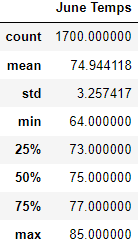
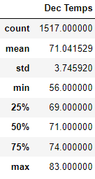
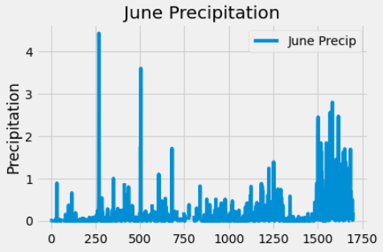
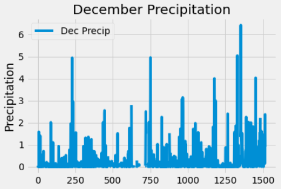

# Oahu Climate Analysis

## Contents
- [Overview of the Project](#overview)
- [Files](#files)
- [Results](#data-analysis-results)
- [Summary](#summary)

## Overview
The purpose of the analysis is provide climate analysis data for Oahu, for the months of June and December. This analysis should help the investor make an informed decision on opening a surf and ice cream shop that can function all year round. 

## Files
- SurfsUp_Challenge.ipynb  - Contains code used in the challenge

## Data Analysis Results

Below are some of the key differences between June and December weather in Oahu:

1. The median and average temperature in June generally higher, as indicated by the 4 deg differnce in mean and median temperatures.
2. The min temperatures in December are lower by 8 deg F. While this would lead to some difference in water temperature, the drop may not be enough to cause a significant impact on surfing.
3. Max temperatures are higher in June by 2 deg F.

The two statistics tables below show the difference in temperatures between June and December

## Summary

This analysis provides some insight into temperature differences between June and December. Overall June temperatures are higher than in December, and statistics indicate that neither of the  months have extreme temperatures that would impact the investor's intentions. However, there are some other key metrics like precipitation, that are important to make better investment decisions. The results below are from two additional queries included in the challenge.

1. June Precipitation: Plot of precipitaiton data below and the computed statistics show that overall June has lower precipitation compared to December. There are less than 7% of June days that have over 0.5 in of precipitation.

2. December Precipitation: Image below shows that December in general has higher precipitatin than June. ~12% of the days have >0.5 in of precipitation. While this by itself may not matter much, the colder days in June combined with the higher precipitation makes December a worse month for surfing and ice cream consumption.

